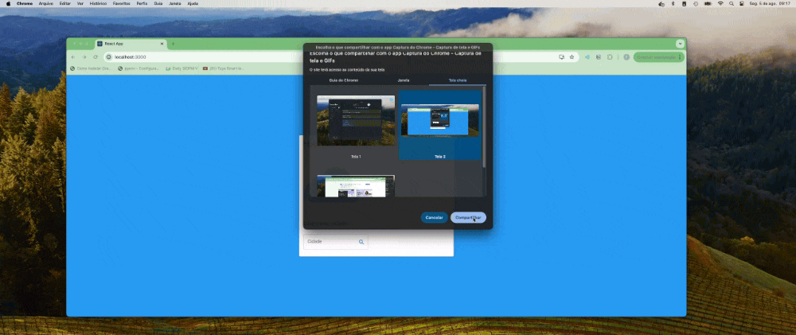

# React Weather App - ReactJS Projects

### How to start
docker-compose up -d --build

### APIs Used
[Open Weather APIs](https://openweathermap.org/)

https://openweathermap.org/current

### API Info
* Method: `GET`
* URL: `https://api.openweathermap.org/data/2.5/weather?q={CITY_NAME}&appid={API_KEY}`

### Icons & Font -
* Icons: [jrpaivadev/react-weather-app](https://github.com/jrpaivadev/react-weather-app/tree/master/public/icons)
* Font: [Roboto]

### Libraries used
* `styled-components`
* `axios`
* `react-scripts`
* `@mui/icons-material`
* `@mui/material`
* `@mui/styles`
